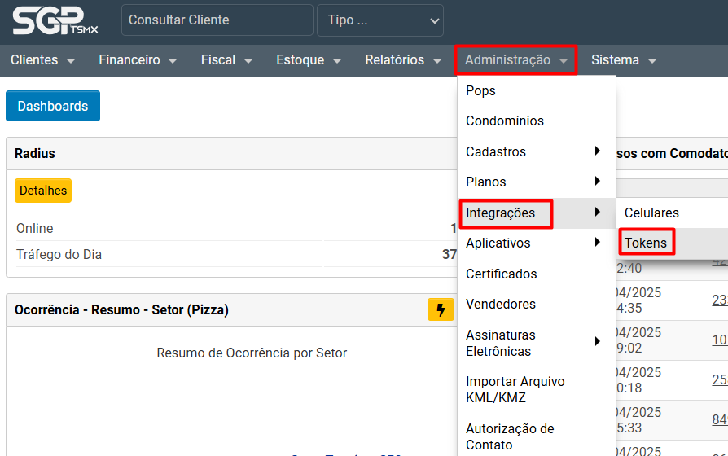
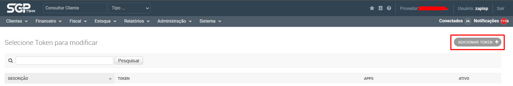
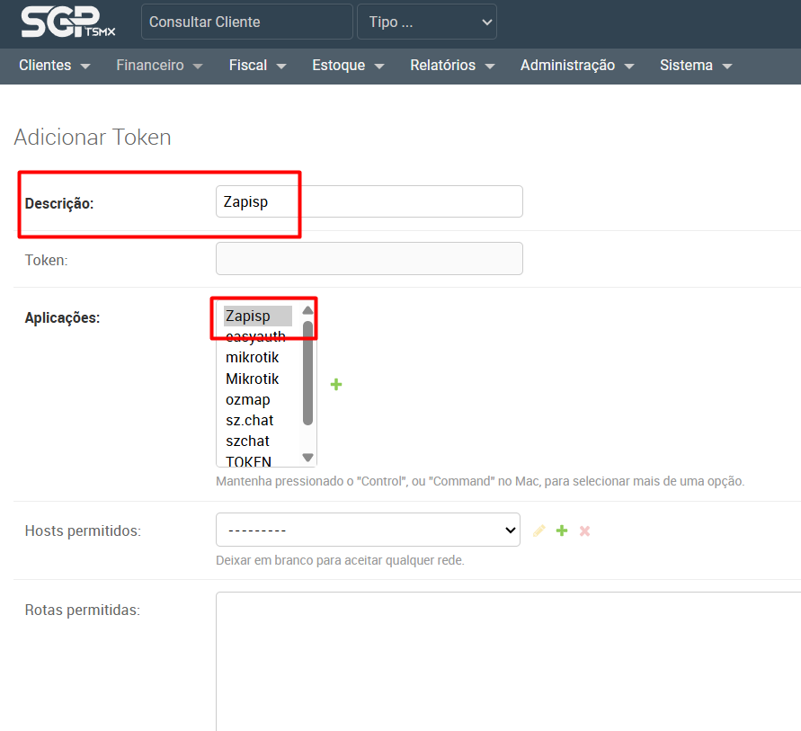
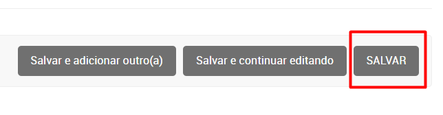
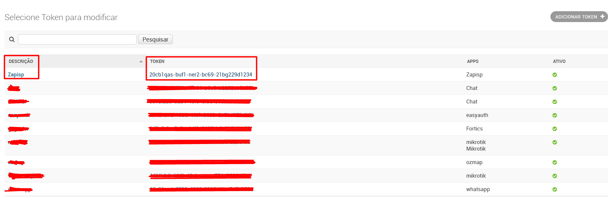

## Authentication

A primeira coisa a se fazer antes de realizar qualquer chamada no SGP é gerar o token do aplicativo Zapisp no SGP.

## Passo 1: Esse tutorial vai supor que voce já está logado no SGP.

- Navegue para a seção de tokens do SGP, que está em **Administração > Integrações > Tokens**

## Passo 2: Clique no botão **ADICIONAR TOKEN** como mostrado na imagem abaixo.

## Passo 3: Na pagina de **Adicionar Token** basta preencher a Descrição como **Zapisp** e criar uma Aplicação chamada Zapisp e marcar como está na foto.

## Passo 4: Agora basta salvar.

## Passo 5: Após ter criado o token ele será exibido na listagem, agora só copiar o nome do app e o token e utilizar nas suas rotas. 

<Note>
 Todas as chamadas para a API do SGP devem conter ao menos dois parâmetros, **app** e **token** que são gerados pelo SGP na aba Administração > Integrações > Tokens.
</Note>